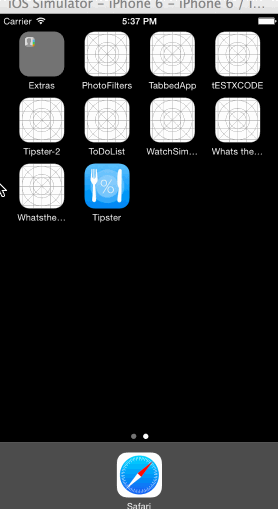

This is an iPhone demo application to calculate the tip for a given dollar amount. 

Time spent: 6 hours spent in total

Completed user stories:

* [x]Required: User can enter a dollar amount to calculate tip and total
* [x]Required: User can change the tip percentage to 10%, 20% or 22% and view the tip and total
* [x]Required: User can view the total amount split by the number of people 

Optional  Added an app icon

Optional  Added Launch screen

Walkthrough of all user stories using LiceCap

